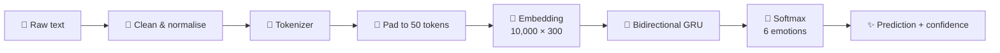

<div align="center">

# 🎭 Undertone

### *Hear the feeling behind the words.*

A deep learning API and web app that reads a sentence and tells you the emotion hiding underneath it.

<br>


<br>

**[🌐 Live Demo](https://undertone-4z6z.onrender.com)** · **[📖 API Docs](https://undertone-4z6z.onrender.com/docs)** · **[🐛 Report a Bug](https://github.com/V-Madara/Undertone/issues)**

</div>

<br>

---

## ✨ What is Undertone?

Undertone takes any piece of English text and classifies the emotion it carries. It runs a **Bidirectional GRU** neural network behind a fast **FastAPI** backend, with a clean web interface on top, so you can type a sentence and instantly see how the model reads it. Nothing you type is stored.

> 💡 **Try it now:** [undertone-4z6z.onrender.com](https://undertone-4z6z.onrender.com)  
> The app is on Render's free tier, so the first request after a period of inactivity can take a little while to wake up.

It recognises six emotions:

| | Emotion | Example |
|:-:|---|---|
| 😢 | **Sadness** | *"I miss the way things used to be"* |
| 😄 | **Joy** | *"I feel so happy and excited"* |
| ❤️ | **Love** | *"I adore spending time with you"* |
| 😠 | **Anger** | *"I can't believe they did this to me"* |
| 😨 | **Fear** | *"I'm terrified of what happens next"* |
| 😲 | **Surprise** | *"I never expected that to happen"* |

<br>

## 📸 Preview

<!-- Add a screenshot or GIF of the app, then uncomment: -->
<!--  -->

Open the **[live demo](https://undertone-4z6z.onrender.com)**, type something you'd actually say, and hit **Analyze**.

<br>

## 🧠 How It Works



1. **Preprocess.** The text is lowercased, apostrophes are removed, and anything that isn't a letter or number is stripped.
2. **Tokenize and pad.** Words become integer IDs and every sequence is padded or truncated to 50 tokens.
3. **Embed.** Each token maps to a 300-dimensional vector from a vocabulary of 10,000 words.
4. **Read both ways.** A Bidirectional GRU reads the sentence forwards and backwards to capture context.
5. **Classify.** A softmax layer returns a probability for each of the six emotions.

<br>

## 📊 Model & Performance

**Dataset:** [`dair-ai/emotion`](https://huggingface.co/datasets/dair-ai/emotion), short English sentences labelled with six emotions (16,000 training and 2,000 test examples).

**Architecture**

| Layer | Details |
|---|---|
| Embedding | 10,000 vocabulary × 300 dimensions, input length 50 |
| Bidirectional GRU | 128 units, returns sequences |
| Dropout | 0.5 |
| Bidirectional GRU | 64 units |
| Dropout | 0.5 |
| Dense | 6 units, softmax |

**Training setup:** Adam optimizer, sparse categorical cross-entropy, batch size 32, balanced class weights to handle the uneven label distribution, and early stopping (patience 3, best weights restored).

**Results on the test set**

| Model | Test accuracy | Test loss |
|---|:-:|:-:|
| **BiGRU** ⭐ *(deployed)* | **92.1%** | 0.187 |
| BiLSTM | 88.8% | 0.355 |
| LSTM | 28.2% | 1.792 |
| SimpleRNN | 21.6% | 1.784 |
| GRU | 11.3% | 1.771 |

The bidirectional models clearly outperformed the unidirectional baselines, which failed to train properly. Reading the sentence in both directions helps the model use context on either side of an emotional word.

<br>

## 🚀 Getting Started

### Prerequisites

- Python **3.12**
- `pip`

### Installation

```bash
# 1. Clone the repository
git clone https://github.com/V-Madara/Undertone.git
cd Undertone

# 2. Create and activate a virtual environment
python -m venv .venv
source .venv/bin/activate        # Windows: .venv\Scripts\activate

# 3. Install dependencies
pip install -r requirements.txt

# 4. Start the server
uvicorn main:app --reload
```

Open **http://127.0.0.1:8000** in your browser and start typing.

<br>

## 🔌 API Reference

Interactive docs are available at `/docs` (Swagger UI) once the server is running.

### `POST /predict`

Analyse the emotion of a piece of text.

**Request**

```json
{
  "text": "I feel so happy and excited"
}
```

**Response**

```json
{
  "text": "I feel so happy and excited",
  "predicted_emotion": "joy",
  "confidence": 0.97,
  "all_probabilites": {
    "sadness": 0.004,
    "joy": 0.970,
    "love": 0.011,
    "anger": 0.006,
    "fear": 0.005,
    "surprise": 0.004
  }
}
```

**Try it with cURL**

```bash
curl -X POST "http://127.0.0.1:8000/predict" \
     -H "Content-Type: application/json" \
     -d '{"text": "I feel so happy and excited"}'
```

> Input must be between 1 and 2000 characters.

### `GET /health`

Check that the server is up and the model is loaded.

```json
{
  "status": "Server is running",
  "model_loaded": true
}
```

<br>

## 📁 Project Structure

```
Undertone/
├── Artifacts/
│   ├── BiGRU_Model.keras     # Trained Bidirectional GRU model
│   └── tokenizer.pkl         # Fitted tokenizer
├── static/
│   └── index.html            # Web interface
├── main.py                   # FastAPI application
├── requirements.txt          # Python dependencies
└── README.md
```

<br>

## 🛠️ Tech Stack

| Layer | Technology |
|---|---|
| **Model** | TensorFlow 2.20 · Keras 3.13 · Bidirectional GRU |
| **Backend** | FastAPI · Uvicorn · Pydantic |
| **Frontend** | HTML · CSS · JavaScript |
| **Training** | Google Colab · scikit-learn · pandas |
| **Dataset** | Hugging Face `dair-ai/emotion` |
| **Hosting** | Render |

<br>

## ☁️ Deployment

Undertone is deployed on **[Render](https://render.com)** as a web service.

| Setting | Value |
|---|---|
| **Build command** | `pip install -r requirements.txt` |
| **Start command** | `uvicorn main:app --host 0.0.0.0 --port $PORT` |
| **Environment** | `PYTHON_VERSION=3.12.4` |

> [!IMPORTANT]
> The model was trained with **TensorFlow 2.20 / Keras 3.13.2**. Keras 3 model files are not backward compatible, so keep these versions pinned in `requirements.txt` or the model will fail to load.

<br>

## ⚠️ Limitations

- **Evaluation caveat.** The test set was also used as the validation set for early stopping, so the 92.1% figure is likely slightly optimistic. A separate held-out split would give a cleaner estimate.
- **Short, first-person text works best.** The training data is made of short sentences, so long or formal passages may be classified less reliably.
- **Six emotions only.** Text that expresses something outside these categories is still forced into one of them, and neutral text has no class of its own.
- **Tone and phrasing matter.** Formal or task-focused sentences can be misread. In testing, *"I finally completed my project today, and I'm incredibly happy…"* was classified as anger instead of joy.
- **English only.**

<br>

## 🗺️ Roadmap

- [ ] Add a confidence bar chart for all six emotions in the UI
- [ ] Support batch predictions
- [ ] Add a confusion matrix image to the README
- [ ] Evaluate on a separate held-out test split
- [ ] Add a neutral class and more diverse training data
- [ ] Dockerise the app

<br>

## 🤝 Contributing

Contributions, issues, and feature requests are welcome. Feel free to open an issue or submit a pull request.

1. Fork the project
2. Create your branch (`git checkout -b feature/amazing-feature`)
3. Commit your changes (`git commit -m "Add amazing feature"`)
4. Push to the branch (`git push origin feature/amazing-feature`)
5. Open a pull request

<br>

## 📄 License

Distributed under the MIT License. See `LICENSE` for more information.

<br>

---

<div align="center">

**Built with ❤️ by [V-Madara](https://github.com/V-Madara)**

If Undertone made you feel something, consider giving it a ⭐

</div>
